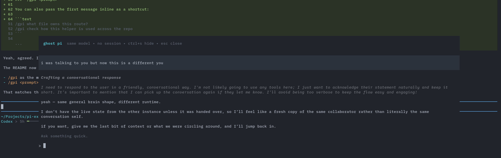

# pi-ghost

Ephemeral side conversation overlay for [pi](https://github.com/earendil-works/pi).

Open a temporary "ghost" session inside the current pi UI, ask something quick, hide it, bring it back, then close it without saving any session history.



## Install

```bash
pi install npm:@ogulcancelik/pi-ghost
```

Or add it manually to `~/.pi/agent/settings.json`:

```json
{
  "packages": ["npm:@ogulcancelik/pi-ghost"]
}
```

Then reload pi:

```text
/reload
```

## What it does

`pi-ghost` adds `/gpi` and `/btw` commands that open a floating overlay backed by a separate **in-memory** `AgentSession`.

So:

- it starts with the **same currently selected model** as the main session
- `/btw` forks from the last stable main-session snapshot and appends short side-question instructions after that copied context
- `/btw` blocks actual tool execution so it answers directly from context
- `/gpi` starts blank, appends read-only side-agent instructions, and runtime-blocks non-read-only operations without changing the tool prompt shape
- it uses **no persisted session file**
- it renders with native pi components for user messages, assistant messages, thinking blocks, and tool execution cards
- it can be **hidden** without losing the temporary conversation
- when you **close** it, the ghost session is aborted and disposed completely

## Usage

### `/gpi`

Open a read-only ghost overlay, then type directly into the ghost UI. `/gpi` allows only `read`, `ls`, and `grep` tool calls and blocks bash, edits, and other state-changing tools at runtime.

```text
/gpi
```

Main flow:

1. run `/gpi`
2. the overlay opens
3. type into the ghost prompt
4. press `Enter`

### `/gpi <prompt>`

You can also pass the first message inline as a shortcut:

```text
/gpi what file owns this route?
/gpi check how this helper is used across the repo
```

If the overlay is already open, `/gpi <prompt>` sends another message into the ghost session.
If the overlay is hidden, run `/gpi` again to bring it back.

### `/btw`

Use `/btw` like `/gpi`, but start from an ephemeral in-memory fork of the latest stable main-session context. It is for quick side questions, not continuing prior tool work:

```text
/btw
/btw based on what we already discussed, what should I check next?
```

## Controls

- `Enter` — send message to ghost pi
- `↑` / `↓` — scroll the transcript
- `PageUp` / `PageDown` — scroll faster
- `Home` / `End` — jump to top or bottom
- `Ctrl+S` — hide the overlay
- `Ctrl+L` — clear the current side history (does not affect the main session)
- `Esc` — close the ghost session completely

When hidden, a small widget is shown above the prompt:

```text
/<command> is running • run /<command> to bring it back
```

## Behavior

Ghost pi is **not** your main session.

The overlay opens at the latest message and stays in follow mode while new output streams. Scroll up to inspect older output, then use `End` to jump back to live output.

It has its own temporary conversation state:

- hide it → state stays in memory
- run the same command again → continue where you left off
- close it → state is gone

The ghost session uses the **main session's model at the moment it is created**.
If you change models in the main session later, the already-open ghost session keeps using its existing model until you close and reopen it.

`/btw` uses a cached stable main-session snapshot, so it can open while the main agent is streaming or running tools without waiting for idle. Its copied prompt/context prefix stays immutable; BTW-specific behavior is appended as a hidden context message before side questions. Later main-session turns are not synced into an already-open `/btw` unless you clear/reopen it. `/gpi` uses the same hidden-message instruction pattern with a blank side context and a runtime read-only operation blocker, so it does not alter the generated tool prompt for cache shape.

## Why

Useful when you want to:

- ask a small side question without polluting the main thread
- use `/btw` for a cache-friendly plain answer from existing context
- use `/gpi` to inspect files with read-only tools in parallel
- keep a temporary tangent around while continuing the main conversation

`pi-ghost` is for those little "btw" moments without leaving the current TUI.

## Requirements

- [pi](https://github.com/earendil-works/pi) with extension support
- interactive mode (the overlay is TUI-only)

## Development

Run from this repo with:

```bash
pi -e /absolute/path/to/packages/pi-ghost/index.ts
```

## License

MIT
